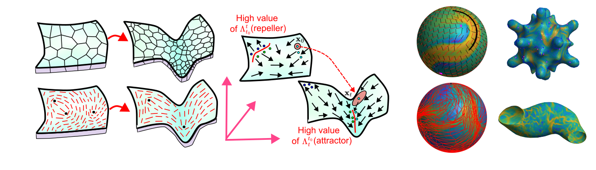

## Lagrangian and Eulerian Coherent Structures for Flows on Curved Surfaces, Euclidean Spaces, and Sparse & Noisy Trajectories

The `ftle_on_curved_surface` folder contains code for computing Lagrangian and Eulerian Coherent Structures (CSs) for flows on curved surfaces. The method is described in the accompanying paper by Santhosh et al. [1], and a tutorial for using the code is available in the [documentation](https://sreejithsanthosh.github.io/FTLEhub/docs/Tutorials/FTLECurvedSurface.html).

If using any of this code, please cite:

[1] Santhosh, S., Zhu, C., Fencil, B., & Serra, M. (2025). *Coherent Structures in Active Flows on Dynamic Surfaces*. bioRxiv, 2025-05.

For completeness, this repository also includes code for computing Lagrangian CSs for flows defined on 2D and 3D Euclidean grids in the `ftle_from_euclidean_grid` folder. Tutorial for using the code is available in the [documentation](https://sreejithsanthosh.github.io/FTLEhub/docs/Tutorials/FTLEEuclidean.html).

The `ftle_from_sparse_trajec` folder contains code for computing Lagrangian CSs from sparse and noisy trajectory data in 2D and 3D. Tutorial for using the code is available in the [documentation](https://sreejithsanthosh.github.io/FTLEhub/docs/Tutorials/FTLESparseTrajectoriesMatlab.html). If you use this part of the code, please cite:

[2] Molawi, S., Serra, M., Maiorino, E., & Mahadevan, L. (2023). *Detecting Lagrangian coherent structures from sparse and noisy trajectory data*. Journal of Fluid Mechanics (2023).